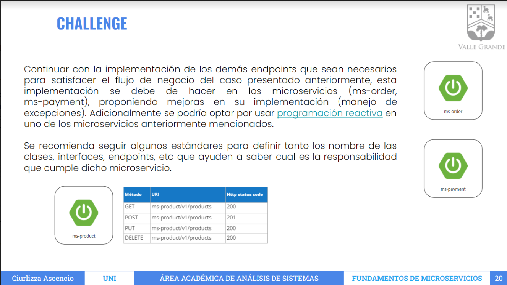

# Talleres de Microservicios

## __Challenge de los talleres 1 y 2__

__Challenge 1__

Continuar con la implementación de los demás endpoints que sean necesarios para satisfacer el flujo de negocio del caso presentado anteriormente, esta implementación se debe de hacer en los microservicios (ms-order, ms-payment), proponiendo mejoras en su implementación (manejo de excepciones).

Se recomienda seguir algunos estándares para definir tanto los nombre de las clases, interfaces, endpoints, etc que ayuden a saber cual es la responsabilidad que cumple dicho microservicio.

